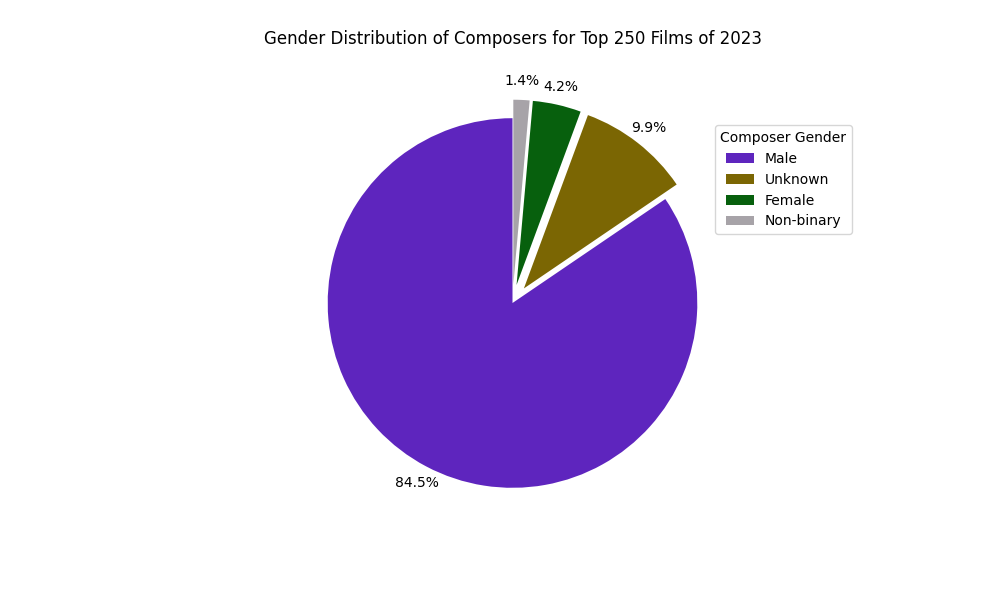
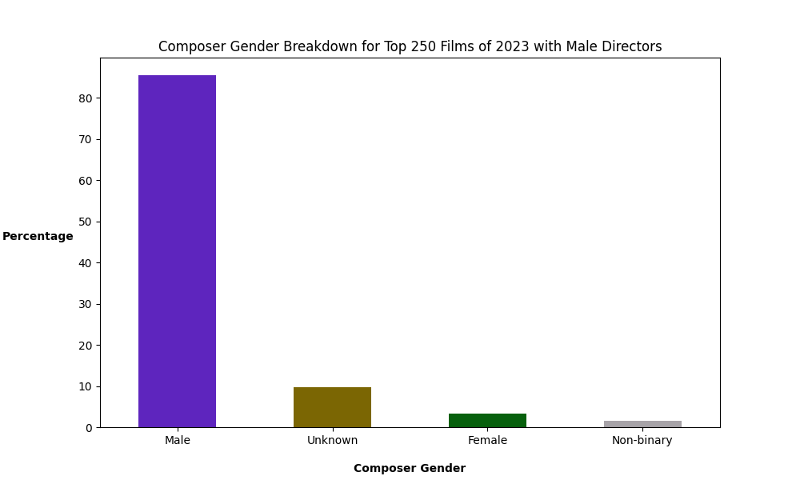
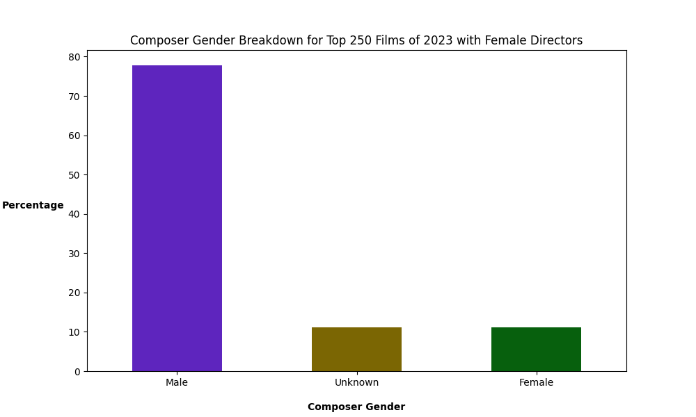
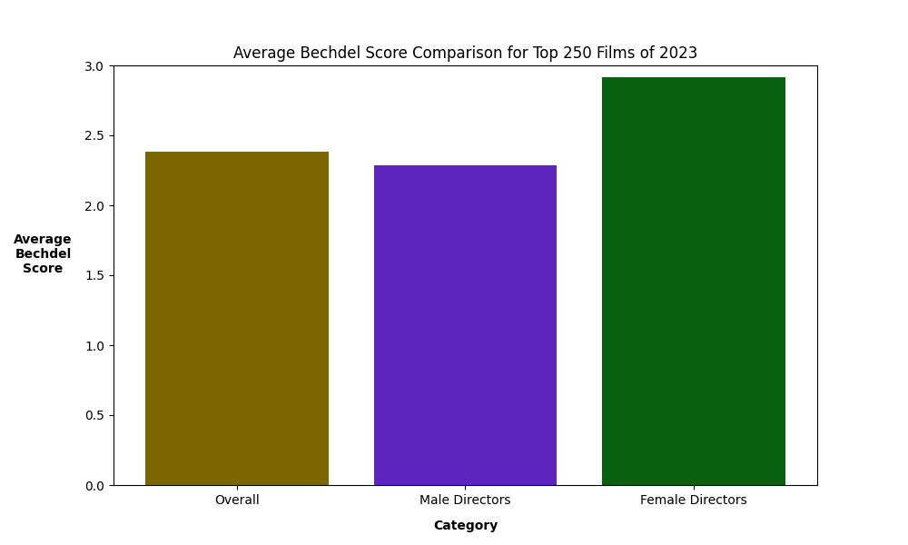
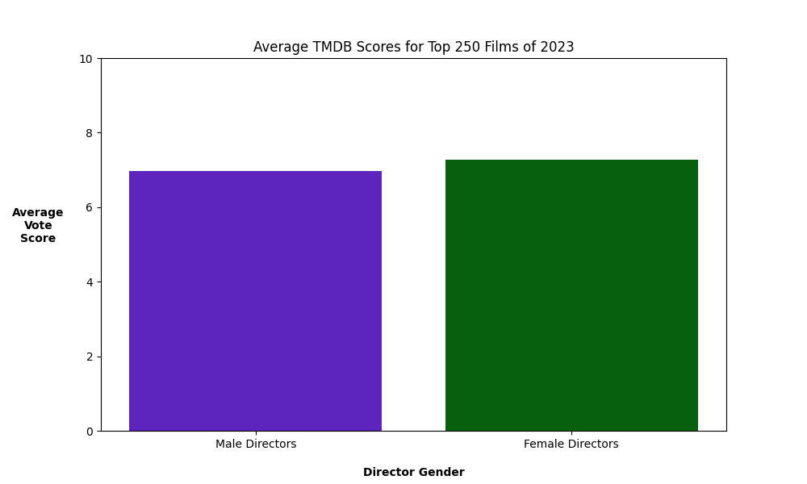

# Gender Representation in the Top 250 Films of 2023

## Overview
This project analyses the Top 250 Films of 2023 (defined as the highest-grossing films in the USA) to examine gender representation using metrics such as Bechdel Test scores and audience ratings from TMDB.

As a female composer in the film industry, I was inspired to explore this topic following the success of Barbie (2023), which sparked widespread discussions about gender representation both on and offscreen. 
In contrast to my observations, some of my male colleagues suggested that the industry had begun to overly favour female representation. This study aims to objectively examine whether these claims align with actual data.

### Key areas of focus include:

- **Director Gender Distribution:** Directors are often the primary creative force behind a film, and their representation can significantly influence the industry.
- **Impact on Composer Gender:** Directors frequently have the final say in hiring decisions, including the selection of composers. At the time of this study, only four female composers have won the Academy Award for Best Score, highlighting a significant gender disparity in this field.
- **Bechdel Test Scores:** This metric evaluates the representation of female characters in films, with a score ranging from 0 to 3 based on the following criteria:
The film includes at least two women,
who talk to each other,
about something other than a man.

The study also examines whether a director's gender influences the Bechdel score of their films and evaluates audience ratings from TMDB to determine if there are differences in perceived quality between films directed by men versus women.

## Methodology
This section outlines the technical approach and workflow used in the project, emphasising how the data was collected, processed, analysed, and visualised. Below is a breakdown of the methodology:

### 1. Data Collection
The project relies on two main APIs for data collection:

- **TMDB API**: Used to retrieve the top 250 films of 2023 and detailed information such as vote averages, director, and composer details.
- **Bechdel Test API**: Used to fetch Bechdel Test scores for films based on their IMDb IDs.

**Key steps:**

####  Film Identification:
The `main.py` file runs a script to collect the top 250 grossing films from the US using the TMDB.
The `ids.py` and `ids_clean.py` scripts clean and standardise the IMDb IDs retrieved from TMDB.
In `bechdel.py` each IMDb ID is then used to query the Bechdel Test API in order to obtain their Bechdel score.

####  Crew Data Retrieval:
The `directors.py` and `composers.py` scripts query the TMDB API to extract detailed crew information, focusing specifically on directors and composers.

####  Database Integration:
Data is stored in a MySQL database (top_movies, directors, composers, and rating tables) for easy querying and analysis.

### 2. Data Cleaning and Validation
Data consistency and accuracy are ensured through:

#### Standardisation:
Titles from the TMDB and Bechdel APIs are matched and validated.
The `ids_clean.py` script removes the "tt" prefix from IMDb IDs for uniformity.

#### Validation:
Scripts in `tests.py` check for errors or inconsistencies in the data retrieval process.
Duplicate entries and missing values are handled programmatically.

### 3. Data Analysis
The `data.py` script performs exploratory data analysis using Pandas and SQLAlchemy. 
Key metrics analysed include:

#### Bechdel Scores:
Distribution and averages for films, segmented by director gender.
#### Director and Composer Gender Representation:
Gender distribution overall and when segmented by director gender.
#### Audience Ratings:
Analysis of TMDB vote averages by director gender.

### 4. Visualisation
Data visualisations are generated using Matplotlib and Seaborn to illustrate the findings:

#### Bar Charts:
Average Bechdel scores for male vs. female directors.
Average TMDB scores segmented by director gender.
#### Pie Charts:
Gender distribution of directors and composers.
#### Stacked Bar Charts:
Composer gender breakdown by director gender.
Visualisation code resides primarily in `data.py`, ensuring seamless integration with the analysis pipeline.

### 5. Tools and Libraries
The following tools and libraries are used throughout the project:

#### Python Libraries:
pandas, numpy, matplotlib, and seaborn for data manipulation and visualisation.
requests for API interaction.
SQLAlchemy and mysql-connector-python for database management.
#### Database:
MySQL is used for storing and querying data.
#### APIs:
TMDB and Bechdel Test APIs provide the raw data for the analysis.
Refer to the requirements.txt file for a full list of dependencies.

### 6. Workflow Automation
Key scripts automate the data pipeline:

#### Data Retrieval:
`main.py` orchestrates the workflow, calling individual scripts for API queries and database updates.
This is supplemented by the use of `ids.py`, `ids_clean.py`, `composers.py` and `directors.py` to obtain comprehensive data.
`tests.py` is responsible for running tests to verify that the data obtained from both APIs correlates. 

#### Analysis and Reporting:
`data.py` handles analysis and visualisation tasks, generating insights from the database.


## Key Findings

### Director Gender Distribution
- 
  -**Director Gender Distribution:**
  - Male:        84.62%
  - Female:      15.38%

The distribution of Director gender appears to be particularly skewed in favour of male Directors here. 
That would suggest that despite a number of recent high-profile success stories, the overall picture is still lacking in terms of representation.

### Composer Gender Distribution

- **Composer Gender Distribution:**
  - Male:        84.50%
  - Female:      4.23%
  - Non-Binary:  1.41%
  - Unknown:     9.86%

There is a very similar distribution of gender amongst composers here, though there is also the addition of a Non-Binary category which increases the diversity slightly.
There is also a significant amount of "Unknown" genders acccounted for here, which highlights a need for more thorough data collection moving forward.

### Composer Gender Distribution

- **Composer Gender Distribution in Films with a Male Director:**
  - Male:        85.48%
  - Unknown:     9.68%
  - Female:      3.23%
  - Non-Binary:  1.61%

In films directed by males, the gender of the Composer attached to the project was most likely to be male. The percentage of male composers is higher than their representation of in the total amount of composers accounted for in this study. 

### Composer Gender Distribution

- **Composer Gender Distribution in Films with a Female Director:**
  - Male:        77.78%
  - Unknown:     11.11%
  - Female:      11.11%

In films directed by female Directors, the gender of the Composer attached to the project was also most likely to be male. 
That being said, there is a notable increase in the amount of female Composers represented here, and a decrease in the amount of male Composers, suggesting that there is a slight improvement in gender representation. 

### Bechdel Score Comparison by Director Gender

- - **Bechdel Score by Director Gender:**
  - Overall:            2.38 / 3.00
  - Male Directors:     2.29 / 3.00
  - Female Directors:   2.92 / 3.00

It was interesting to note that films directed by female Directors score significantly higher than those directed by males in terms of their Bechdel scores. 
Films directed by women scored higher than the overall average, whereas films directed by men scored below the average. 
This shows how vital it is to reppresentation in storytelling that we increase the amount of female Directors moving forward.

### TMDB Score Comparison by Director Gender

- **Average TMDB Score by Director Gender:**
  - Male Directors:     6.97 / 10.00
  - Female Directors:   7.27 / 10.00

Looking at the average audience rating for these films, it is clear that those directed by women achieved a higher rate of approval. 
This is positive news for future representation, as it is clearly something that audiences respond positively to.

## Conclusion
The findings highlight the significant underrepresentation of female directors and composers in the Top 250 Films of 2023, with male creators dominating both fields. 
Despite this imbalance, films directed by women tend to:

- Score higher on the Bechdel Test, suggesting a stronger focus on gender-inclusive storytelling.
- Receive slightly higher audience ratings on TMDB, indicating positive reception from viewers.
- This project underscores the ongoing need to address gender disparities in the film industry, both in terms of representation and the opportunities available to women and non-binary creators.

## Technologies Used
- **Python** (Pandas, Matplotlib, SQLAlchemy)
- **MySQL** for data storage
- **TMDB API** for movie data retrieval

## How to Run
Follow these steps to set up and run the project:

###  1. Clone the Repository
Clone the project repository to your local machine:

```bash
git clone https://github.com/ELanderea/GenderRepresentationInFilm2023.git
```

###  2. Install Dependencies
Install the required dependencies listed in requirements.txt:

```bash
pip install -r requirements.txt
```
###  3. Input Your API key
Go to `config.py` and update the TMDB API key or Authorisation Token (whichever you prefer) to your own version.
N.B. The Bechdel API does not require an API key.

###  4. Run the Scripts in Order
The scripts must be executed in the following order to ensure the data pipeline runs smoothly:

a. Run main.py
This script orchestrates the data retrieval process and ensures the required movie IDs are collected:

```bash
python main.py
```

b. Run ids.py
This script retrieves raw IMDb IDs for the top 250 films:

```bash
python ids.py
```

c. Run ids_clean.py
This script cleans and standardises the IMDb IDs for further use:

```bash
python ids_clean.py
```

d. Run bechdel.py
This script fetches the Bechdel Test scores using the cleaned IMDb IDs:

```bash
python bechdel.py
```

e. Run composers.py
This script retrieves composer information for each film:

```bash
python composers.py
```

f. Run directors.py
This script retrieves director information for each film:

```bash
python directors.py
```

g. Run tests.py
This script validates the consistency of the collected data across APIs:

```bash
python tests.py
```

### 5. Perform Analysis and Visualisation
After completing all data retrieval and validation steps, run data.py to analyse the data and generate visualisations:

```bash
python data.py
```

## License
Copyright (c) 2023 Emer Landers

All rights reserved.

Permission is hereby granted for viewing and exploring this project for educational or informational purposes only. 
Any other use, including but not limited to reproduction, modification, distribution, or commercial use of any content 
within this project, is strictly prohibited without prior written consent from the owner.

For permissions or inquiries, contact: ELanderea
